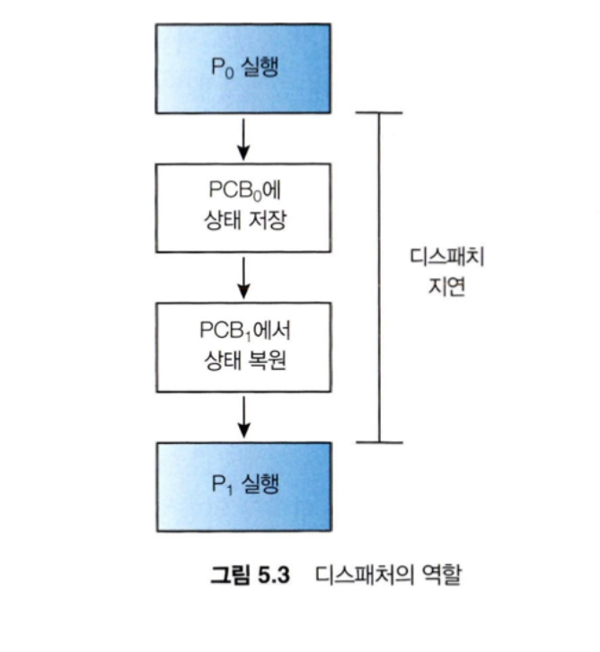

<aside>

**이 장의 목표**

- 다양한 CPU 스케줄링 알고리즘을 설명한다.
- 스케줄링 기준에 따라 CPU 스케줄링 알고리즘을 평가한다.
- 다중 처리기 및 다중 코어 스케줄링과 관련된 쟁점을 설명한다.
- 다양한 실시간 스케줄링 알고리즘을 설명한다.
- Windows, Linux 및 Solaris 운영체제에서 사용되는 스케줄링 알고리즘을 설명한다.
- CPU 스케줄링 알고리즘을 평가하기 위해 모델링 및 시뮬레이션을 적용한다.
- 여러 가지 다른 CPU 스케줄링 알고리즘을 구현하는 프로그램을 설계한다.
</aside>

## 5.1 기본 개념(Basic Concepts)

- 다중 프로그래밍의 목적은 CPU 이용률을 최대화하기 위해 항상 실행 중인 프로세스를 가지게 하는 데 있다.
- 어떤 프로세스가 대기해야 할 경우, 운영체제는 CPU를 그 프로세스로부터 회수해 다른 프로세스에 할당한다.

### 5.1.1 CPU-I/O 버스트 사이클(CPU-I/O Burst Cycle)

- 프로세스 실행은 CPU 실행과 I/O 대기의 사이클로 구성된다.
    - 프로세스들은 이들 두 상태(CPU 실행, I/O 대기) 사이를 교대로 왔다 갔다 한다.
- I/O 중심의 프로그램은 전형적으로 짧은 CPU 버스트를 가질 수 있다.
  CPU 지향 프로그램은 다수의 긴 CPU 버스트를 가질 수 있다.

### 5.1.2 CPU 스케줄러(CPU Scheduler)

- CPU가 유휴 상태가 될 때마다, 운영체제는 준비 큐에 있는 프로세스 중에서 하나를 선택해 실행해야 한다.
    - 선택 절차는 CPU 스케줄러에 의해 수행된다.
- 준비 큐에 있는 레코드들은 일반적으로 프로세스들의 프로세스 제어 블록(PCB)들이다.

### 5.1.3 선점 및 비선점 스케줄링(Preemptive and Nonpreemptive Scheduling)

CPU 스케줄링 결정은 다음의 네 가지 상황에서 발생할 수 있다.

1. 한 프로세스가 실행 상태에서 대기 상태로 전환될 때(I/O 요청이나 자식 프로세스가 종료되기를 기다리기 위해 wait()를 호출할 때)
2. 프로세스가 실행 상태에서 준비 완료 상태로 전환될 때(인터럽트가 발생할 때)
3. 프로세스가 대기 상태에서 준비 완료 상태로 전환될 때(I/O 종료 시)
4. 프로세스가 종료할 때

- 비선점(nonpreemptive) 스케줄링
    - 일단 CPU가 한 프로세스에 할당되면 프로세스가 종료하든지, 또는 대기 상태로 전환해 CPU를 방출할 때까지 점유한다.
- 선점(preemptive) 스케줄링
    - 데이터가 다수의 프로세스에 의해 공유될 때 경쟁 조건을 초래할 수 있다.(두 프로세스가 자료를 공유하는 경우)

### 5.1.4 디스패처(Dispatcher)

- 디스패처는 CPU 코어의 제어를 CPU 스케줄러가 선택한 프로세스에 주는 모듈
    - 한 프로세스에서 다른 프로세스로 문맥을 교환하는 일
    - 사용자 모드로 전환하는 일
    - 프로그램을 다시 시작하기 위해 사용자 프로그램의 적절한 위치로 이동(jump)하는 일

- 디스패치 지연(dispatch latency)
    - 디스패처가 하나의 프로세스를 정지하고 다른 프로세스의 수행을 시작하는 데까지 소요되는 시간을 디스패치 지연이라고 한다.

- 자발적 문맥 교환
  - 현재 사용 불가능한 자원(I/O를 기다리며 블록됨)을 요청했기 때문에 프로세스가 CPU 제어를 포기한 경우 발생한다.
- 비자발적 문맥 교환
  - 타임 슬라이스가 만료돠었거나 우선순위가 더 높은 프로세스에 의해 선점된 경우와 같이 CPU를 빼앗겼을 때 발생한다.

## 5.2 스케줄링 기준(Scheduling Criteria)

CPU 스케줄링 알고리즘을 비교하기 위한 여러 기준이 제시되었다. 비교하는 데 사용되는 특성에 따라서 최선의 알고리즘을 결정하는 데 큰 차이가 발생한다.

- **CPU 이용률**(utilization): 우리는 가능한 한 CPU를 최대한 바쁘게 유지하기를 원한다.
  실제 시스템에서는 40%에서(부하가 적은 시스템의 경우) 90%까지의(부하가 큰 시스템의 경우) 범위를 가져야 한다.(Linux, macOS의 top 명령)
- **처리량**(throughput): CPU가 프로세스를 수행하느라 바쁘다면, 작업이 진행되고 있는 것이다. 작업량 측정의 한 방법은 단위 시간당 완료된 프로세스의 개수로, 이것을 처리량(throughput)이라고 한다.
- **총처리 시간**(turnaround time): 프로세스의 제출 시간과 완료 시간의 간격을 총처리 시간이라고 한다.
- 대기 시간(waiting time): CPU 스케줄링 알고리즘은 프로세스가 실행하거나 I/O을 하는 시간의 양에 영향을 미치지 않는다.
  스케줄링 알고리즘은 단지 프로세스가 준비 큐에서 대기하는 시간의 양에만 영향을 준다.
- 응답 시간(response time): 하나의 요구를 ㅔㅈ출한 후 첫 번째 응답이 나올 때까지의 시간.

> CPU 이용률과 처리량을 최대화하고
총처리 시간, 대기 시간, 응답 시간을 최소화하는 것이 바람직하다.
>

## 5.3 스케줄링 알고리즘(Scheduling Algorithms)

- CPU 스케줄링은 준비 큐에 있는 어느 프로세스에 CPU를 할당할 것인지를 결정하는 문제를 다룬다.

### 5.3.1 선입 선처리 스케줄링(First-Come, First-Served Scheduling)

- 가장 간단한 CPU 스케줄링 알고리즘
- CPU를 먼저 요청하는 프로세스가 CPU를 먼저 할당받는다.
- 비선점형 스케줄링 알고리즘
- 부정적 측면
  - 평균대기 시간은 종종 대단히 길 수 있다.
  - CPU 버스트 시간이 크게 변할 경우 평균 대기 시간도 상당히 변할 수 있다.

호위 효과(convoy effect)

- 모든 다른 프로세스들이 하나의 긴 프로세스가 CPU를 양도하기를 기다리는 것
- CPU와 장치 이용률이 저하되는 결과를 낳는다.
- FCFS에서만 발생하는 단점

### 5.3.2 최단 작업 우선 스케줄링(Shortest-Job-First Scheduling)

- 이 알고리즘은 각 프로세스에 다음 CPU 버스트 길이를 연관시킨다.
- CPU가 이용가능 해지면, 가장 작은 다음 CPU 버스트를 가진 프로세스에 할당한다.
- 두 프로세스가 동일한 길이의 CPU 버스트를 가지면, 순위를 정하기 위해 선입 선처리 스케줄링을 적용한다.
- SJF 스케줄링 알고리즘은 주어진 프로세스 집합에 대해 최소의 평균대기 시간을 가진다는 점에서 최적임을 증명할 수 있다.

선점형 SJF 알고리즘

- 최소 잔여 시간 우선 스케줄링이라고 불린다.

### 5.3.3 라운드 로빈 스케줄링(Round-Robin Scheduling)

- 준비 큐는 원형 큐로 동작한다.
- CPU 스케줄러는 준비 큐를 돌면서 한 번에 한 프로세스에 한 번의 시간 할당량 동안 CPU를 할당한다.
- RR 스케줄링 알고리즘은 선점형

### 5.3.4 우선순위 스케줄링(Priority Scheduling)

- SJF 알고리즘은 우선순위 스케줄링 알고리즘의 특별한 경우
- 우선순위 스케줄링 알고리즘의 주요 문제
  - 무한 봉쇄(indefinite blocking) 또는 기아 상태(starvation)
  - 낮은 우선순위 프로세스들이 CPU를 무한히 대기하는 경우가 발생한다.
- 해결 방안
  - 노화(aging)
    - 오랫동안 시스템에서 대기하는 프로세스들의 우선순위를 점진적으로 증가시킨다.
  - 라운드 로빈 + 우선순위 스케줄링을 결합
    - 우선순위가 가장 높은 프로세스를 실행하고 우선순위가 같은 프로세스들은 라운드 로빈 스케줄링을 사용하여 스케줄 하는 방식이다.

### 5.3.5 다단계 큐 스케줄링(multilevel Queue Scheduling)

- 우선순위 + 라운드 로빈 스케줄링을 사용할 때 단일 큐에 배치되고 실행되었다.
- 프로세스 유형에 따라 프로세스를 여러 개의 개별 큐로 분할하기 위해 다단계 큐 스케줄링 알고리즘을 사용할 수 있다
  - 포그라운드(대화형) 프로세스와 백그라운드(배치) 프로세스
    - 응답시간 요구 사항이 다르므로 스케줄링 요구 사항이 다를 수 있다.
- 다단계 큐 스케줄링 알고리즘에서는 일반적으로 프로세스들이 시스템 진입 시에 영구적으로 하나의 큐에 할당된다.
  - 프로세스들이 포그라운드와 백그라운드의 특성을 바꾸지 않기 때문이다.
  - 스케줄링 오버헤드가 장점이 있으나 융통성이 적다.

### 5.3.6 다단계 피드백 큐 스케줄링(Multilevel Feedback Queue Scheduling)

- 프로세스가 큐들 사이를 이동하는 것을 허용한다.
- 프로세스들을 CPU 버스트 성격에 따라서 구분한다.
  - 어떤 프로세스가 CPU 시간을 너무 많이 사용하면, 낮은 우선순위의 큐로 이동된다.
- 노화(aging)으로 기아 상태를 예방한다.
- 다단계 피드백 큐 스케줄링 알고리즘은 가장 일반적인 CPU 스케줄링 알고리즘이다.

## 5.4 스레드 스케줄링(Thread Scheduling)

대부분 최신 운영체제에서는 스케줄 되는 대상은 프로세스가 아니라 커널 수준 스레드이다.

### 5.4.1 경쟁 범위(Contention Scope)

- 다대일과 다대다 모델을 구현하는 시스템에서는 스레드 라이브러리는 사용자 수준 스레드를 가용한 *LWP상에서 스케줄 한다.
- 윈도우와 리눅스 같은 일대일 모델을 사용하는 시스템은 오직 SCS(시스템-경쟁 범위)를 사용하여 스케줄 한다.
  - CPU상에 어느 커널 스레드를 스케줄 할 것인지 결정하기 위해서 커널이 SCS 사용

*LWP: 사용자 스레드가 하드웨어 CPU 자원을 쓸 수 잇도록 가상 프로세서 역할을 하는 인터페이스

### 5.4.2 Pthread 스케줄링(Pthread Scheduling)

## 5.5 다중 처리기 스케줄링(Multiple-Processor Scheduling)

- 여러 개의 CPU가 사용 가능하다면, 여러 스레드가 병렬로 실행될 수 있으므로 부하 공유(load sharing)가 가능
- 다중 처리기는 여러 개의 물리적 프로세서를 제공하는 시스템

### 5.5.1 다중 처리기 스케줄링에 대한 접근 방법(Approaches to Multiple-Processor Scheduling)

- 비대칭 다중 처리(symmetric multiprocessing)
  - 오직 하나의 코어만 시스템 자료구조에 접근하여 자료 공유의 필요성을 배제하기 때문에 간단하다.
  - 마스터 서버가 전체 시스템 성능을 저하할 수 있는 병목이 된다.
- 대칭 다중 처리(symmetric multiprocessing, SMP)
  - 다중 처리기를 지원하기 위한 표준 접근 방식
  - 각 프로세스의 스케줄러가 준비 큐를 검사하고 실행할 스레드를 선택하여 스케줄링이 실행된다.

스케줄 대상이 되느 스레드를 관리하기 위한 두 가지 가능한 전략

1. 모든 스레드가 공통 준비 큐에 있을 수 있다.
2. 각 프로세서는 자신만의 스레드 큐를 가질 수 있다.

### 5.5.2 다중 코어 프로세서(Multicore Processors)

- 메모리 스톨(memory stall)
  - 프로세서가 메모리에 접근할 때 데이터가 가용해지기를 기다리면서 많은 시간을 허비한다는 것
  - 최신 프로세서가 메모리보다 훨씬 빠른 속도로 작동하기 때문에 주로 발생

### 5.5.3 부하 균등화(Load Balancing)

- 부하 균등화는 SMP 시스템의 모든 처리기 사이에 부하가 고르게 배분되도록 시도한다.
  - 스레드를 위한 자기 자신만의 준비 큐를 갖고 있는 시스템에서만 필요한 기능

### 5.5.2 처리기 선호도(Processor Affinity)

- 프로세서 선호도
  - 캐시 관련 작업들에 비용이 많이 들기 때문에 SMP를 지원하는 대부분의 운영체제는 스레드를 한 프로세서에서 계속 실행시키면서 warm cache를 이용하려고 한다.
- 약한 선호도
  - 운영체제가 동일한 처리기에서 프로세스를 실행시키려고 노력하는 정책을 가지고 있지만, 보장하지 않을 때
- 강한 선호도
  - 프로세스 자신이 실행될 처리기 집합을 명시할 수 있다.

## 5.6 실시간 CPU 스케줄링(Real-Time CPU Scheduling)

- 연성 실시간 시스템
  - 중요한 실시간 프로세스가 스케줄 되는 시점에 관해 아무런 보장을 하지 않는다.
- 경성 실시간 시스템
  - 더 엄격한 요구 조건을 만족시켜야 한다.
  - 태스크는 반드시 마감시간까지 서비스를 받아야 하며 마감시간이 지난 이후에 서비스를 받는 것은 서비스를 받지 않는 것과 동일한 결과를 낳는다.

### 5.6.1 지연시간 최소화(Minimizing Latency)

- 이벤트 지연시간
  - 이벤트가 발생해서 그에 맞는 서비스가 수행될 때까지의 시간

다음의 두 가지 유형의 지연시간이 실시간 시스템의 성능을 좌우한다.

1. 인터럽트 지연시간
2. 디스패치 지연시간

- 인터럽트 지연시간
  - CPU에 인터럽트가 발생한 시점부터 해당 인터럽트 처리 루틴이 시작하기까지의 시간
- 디스패치 지연시간
  - 스케줄링 디스패처가 하나의 프로세스를 블록시키고 다른 프로세스를 시작하는 데까지 걸리는 시간

### 5.6.2 우선순위 기반 스케줄링(Priority-Based Scheduling)