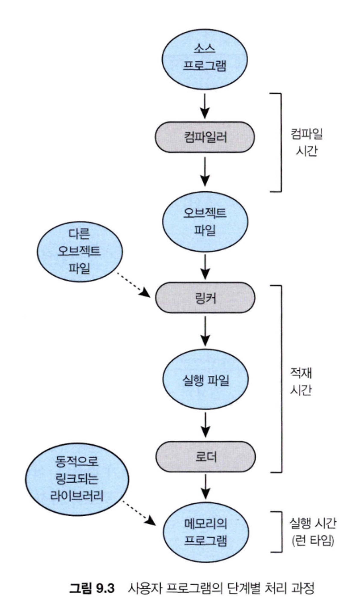
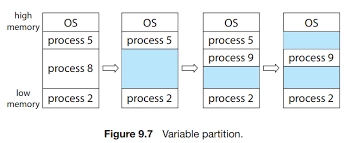

CPU 스케줄링의 결과는 CPU 이용률과 사용자에 제공하는 응답 속도를 향상할 수 있다는 것이다.

그러려면 많은 프로세스를 메모리에 유지해야하는데, 이 장에서는 메모리를 관리하는 다양한 방법에 관해 설명한다.

<aside>

이 장의 목표

- 논리 주소와 물리 주소의 차이점과 주소를 변환할 때 MMU(메모리 관리 장치)의 역할을 설명한다.
- 메모리를 연속적으로 할당하기 위해 최초, 최적 및 최악 접합 전략을 적용한다.
- 내부 및 외부 단편화의 차이점을 설명한다.
- TLB (translation look-aside buffer)가 포함된 페이징 시스템에서 논리 주소를 물리 주소로 변환한다.
- 계층적 페이징, 해시 페이징 및 역 페이지 테이블을 설명한다.
- IA-32, x86-64 및 ARMv8 아키텍처의 주소 변환에 관해 설명한다.
</aside>

## 9.1 배경(Background)

- CPU는 PC(program counter)가 지시하는 대로 메모리로부터 다음 수행할 명령어를 가져오는데 필요한 경우 추가적인 데이터를 더 가져올 수 있으며 반대로 데이터를 메모리로 내보낼 수도 있다.

### 9.1.1 기본 하드웨어(Basic Hardware)

- 메인 메모리와 각 처리 코어에 내장된 레지스터들은
  CPU가 직접 접근할 수 있는 유일한 범용 저장장치이다.
- CPU에 구축된 캐시를 관리하여 운영체제 도움 없이 메모리 접근 속도를 향상한다.

### 9.1.2 주소의 할당(Address Binding)

- 프로그램을 실행하려면 메모리로 가져와서 프로세스 문맥 내에 배치해야 한다.

### 9.1.3 논리 대 물리 주소 공간(Logical Versus Physical Address Space)

- 논리 주소(Logical address)
    - CPU가 생성하는 주소.
- 물리 주소(Physical address)
    - 메모리가 취급하게 되는 주소(메모리 주소 레지스터에 주어지는 주소)

- 메모리 관리 장치(MMU, Memory Management Unit)
    - 가상 주소를 물리 주소로 변환하는 장치

### 9.1.4 동적 적재(Dynamic Loading)

- 동적 적재
    - 루틴이 필요한 경우에만 적재된다는 것

### 9.1.5 동적 연결 및 공유 라이브러리(Dynamic Linking & Shared Libraries)

## 9.2 연속 메모리 할당(Contiguous Memory Allocation)

- 메인 메모리는 운영체제뿐만 아니라 여러 사용자 프로세스도 수용해야 한다.
- 두 개의 부분으로 분할
    - 운영체제를 위한 부분
    - 사용자 프로세스를 위한 부분

### 9.2.1 메모리 보호(Memory Protection)

- CPU 스케줄러가 다음으로 수행할 프로세스를 선택할 때, 디스패처는 문맥 교환의 일환으로 재배치 레지스터와 상한 레지스터에 정확한 값을 적재한다.
- CPU에 의해서 생성되는 모든 주소는 이 레지스터들의 값을 참조해서 확인 작업을 거치기 때문에 다른 사용자 프로그램을 수행중인 사용자 프로그램의 접근으로부터 보호할 수 있다.

### 9.2.2 메모리 할당(Memory Allocation)

- 메모리를 할당하는 가장 간단한 방법 중 하나는 프로세스를 메모리의 가변 크기 파티션에 할당하는 것이다.
- 가변 파티션
    - hole: 하나의 큰 사용 가능한 메모리 블록

- 동적 메모리 할당 문제(dynamic storage allocation problem)
    - 가용 공간-리스트로부터 크기 n-바이트 블록을 요구하는 것을 어떻게 만족시켜 줄 것이냐를 결정하는 문제이다.
    - 최초 적합(first-fit)
        - 첫 번째 사용 가능한 가용 공간을 할당한다. 충분히 큰 가용 공간을 찾았을 때 검색을 끝낼 수 있다.
    - 최적 적합(best-fit)
        - 사용 가능한 공간 중에서 가장 작은 것을 택한다. 이 방법은 아주 작은 가용 공간을 만들어낸다.
    - 최악 적합(worst-fit)
        - 가장 큰 가용 공간을 택한다.

모의실험을 통해서 연구해 보면 최초 적합과 최적 적합 모두가 시간과 메모리 이용 효율 측면에서 최악 적합보다 좋다는 것이 입증되었다.

최초 적합이나 최적 적합이나 공간 효율성 측면에서는 어느 것이 항상 더 좋다고 말할 수 없지만 최초 적합이 일반적으로 속도가 더 빠르다.

### 9.2.3 단편화(Fragmentation)

- 외부 단편화(external fragmentation)
    - 유휴 공간들을 모두 합치면 충분한 공간이 되지만 그것들이 너무 작은 조각들로 여러 곳에 분산되어 있을 때 발생
- 내부 단편화(internal fragmentation)
    - 메모리를 아주 작은 공간들로 분할하고 프로세스가 요청하면 할당을 항상 이 정수배로만 하면 할당된 공간은 늘 요구된 공간보다 약간 클 수 있다.
- 해결 방법
    - 외부 단편화
        - 압축(compaction)
        - 페이징
            - 한 프로세스의 논리 주소 공간을 여러 개의 비연속적인 공간으로 나누어 필요한 크기의 공간이 가용해지는 경우 물리 메모리를 프로세스에 할당하는 방법

## 9.3 페이징(Paging)

- 프로세스의 물리 주소 공간이 연속되지 않아도 되는 메모리 관리 기법인 페이징
- 운영체제와 컴퓨터 하드웨어 간의 협력을 통해 구현

### 9.3.1 기본 방법

- 프레임
    - 물리 메모리는 프레임이라 불리는 같은 크기 블록으로 나누어진다.
- 페이지
    - 논리 메모리는 페이지라 불리는 같은 크기의 블록으로 나누어진다.
- 프로세스가 실행될 때 그 프로세스의 페이지는 메인 메모리 프레임으로 저장된다.
- CPU에서 나오는 모든 주소는 페이지 번호와 페이지 오프셋 두 개의 부분으로 나누어진다.
- 페이지 번호는 페이지 테이블을 액세스할 때 사용된다.

### 9.3.4 공유 페이지(Shared Pages)

- 페이징의 장점은 공통의 코드를 공유할 수 있다는 점.

## 9.4 페이지 테이블의 구조(Structure of the Page Table)

### 9.4.1 계층적 페이징(Hierarchical Paging)

요즈음 많은 현대 컴퓨터는 매우 큰 주소 공간을 가진다. 이러한 환경에서는 페이지 테이블도 상당히 커진다.  시스템에서 페이지의 크기가 4KB라면 페이지 테이블은 100만개 이상의 항목으로 구성될 것이다.

- 2단계 페이징 기법
    - 페이지 테이블 자체가 다시 페이징되게 하는 것.
    - 주소 변환이 바깥 페이지 테이블에서 시작하여 안쪽으로 들어오므로 이 방식을 forward-mapped 방식이라 한다.

### 9.4.2 해시 페이지 테이블(Hashed Page Tables)

- 주소 공간이 32비트보다 커지면 가상 주소를 해시로 사용하는 해시 페이지 테이블을 많이 쓴다.

## 9.5 스와핑(Swapping)

프로세스가 실행되기 위해서는 프로세스의 명령어와 명령어가 접근하는 데이터가 메모리에 있어야 한다. 그러나 프로세스 또는 프로세스의 일부분은 실행 중에 임시로 백업 저장장치로 내보내어 졌다가 실행을 계속하기 위해 다시 메모리로 되돌아 올 수 있다.

모든 프로세스의 물리 주소 공간 크기의 총합이 시스템의 실제 물리 메모리 크기보다 큰 경우에도 스와핑을 이용하면 동시에 실행하는 것이 가능하여 다중 프로그래밍의 정도를 증가시킨다.

### 9.5.1 기본 스와핑(Standard Swapping)

- 표준 스와핑에는 메인 메모리와 백업 저장장치 간에 전체 프로세스를 이동한다.

### 9.5.2 페이징에서의 스와핑(Swapping with Paging)

- Linux 및 윈도우를 포함한 대부분의 운영체제는 이제 프로세스 전체가 아닌 프로세스 페이지를 스왑할 수 있는 변형 스와핑을 사용
- 페이지-아웃
    - 페이지를 메모리에서 백업 저장장치로 이동시킨다.
- 페이지-인
    - 백업 저장장치 → 메모리

### 9.5.3 모바일 시스템에서의 스와핑

- 모바일 시스템은 어떠한 형태의 스와핑도 지원하지 않는 것이 일반적이다.

<aside>

페이지를 스와핑 하는 것이 프로세스 전체를 스와핑하는 것보다 효율적이라고 하더라도 어떤 경우건 스와핑이 필요하다는 것은 사용 가능한 물리 메모리보다 활성 프로세스가 더 많다는 것을 나타낸다.

</aside>

