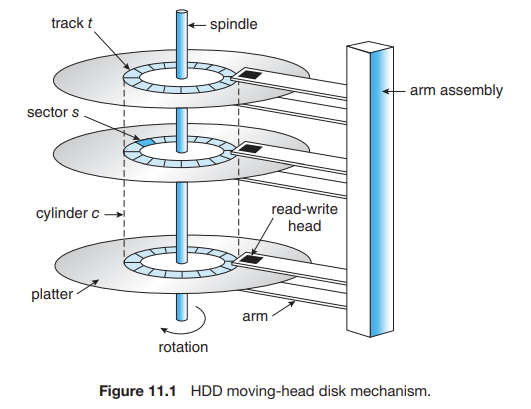
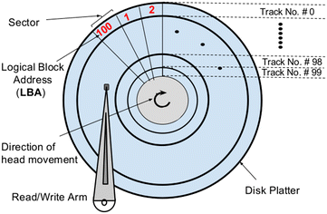
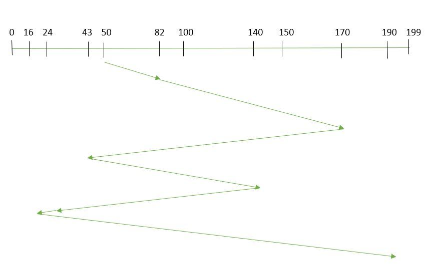
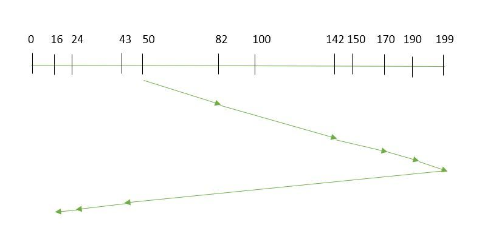
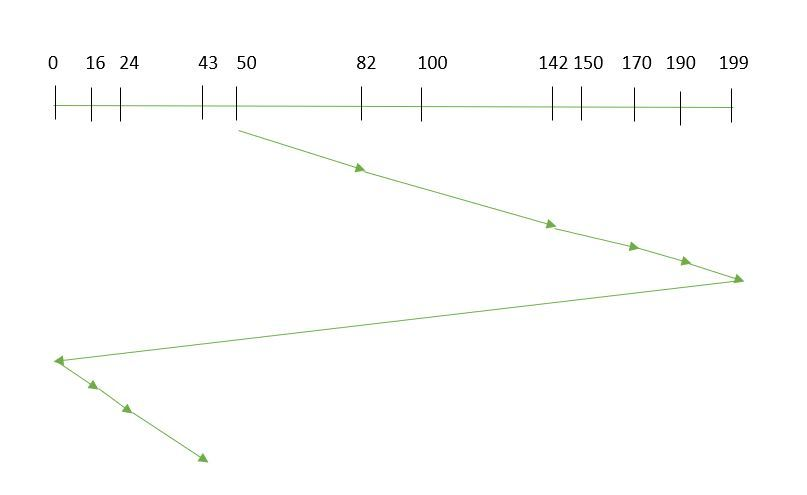
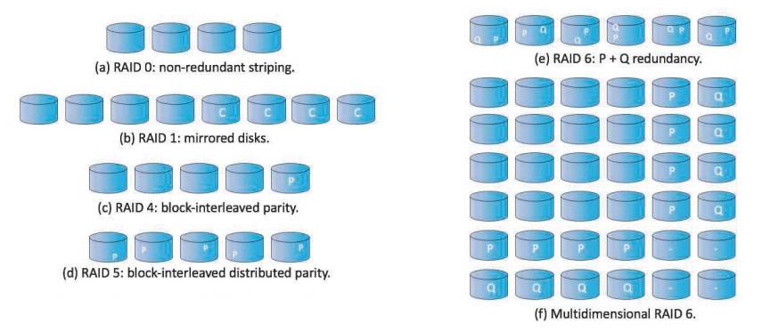
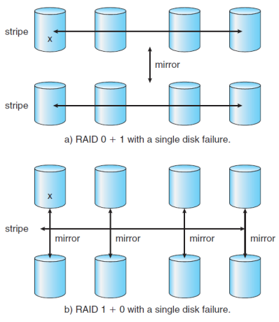

## HDD(hard disk drive)

platter를 사용하여 데이터를 저장하는 장치로,
platter는 회전하며 읽기 및 쓰기 헤드가 platter 표면을 따라 움직여 데이터를 읽고 씁니다.

## dist structure

- platter: 데이터를 저장하는 자기 디스크
  - 자기 패턴을 통해 정보를 read/write한다.
  - 
  - platter의 표면은 원형인 track으로 논리적으로 나누어져 있고, 이것은 다시 sector로 나누어져있다.
  - 각 sector의 크기는 고정되어 있으며, 일반적으로 0.5KB(512Byte)~4KB의 크기를 가진다.
- read-write head: platter 표면을 따라 움직여 데이터를 읽고 쓰는 장치
- spindle: platter를 회전시키는 축
- cylinder: 동일한 arm 위치에 있는 track의 집합

## disk scheduling

- seek time: time taken to move the disk arm to the track where data is located.
- rotational latency: time taken for the desired sector to rotate under the read/write head.
- transfer time: time taken to actually read or write the data, depending on disk speed and data size.

$$disk\ access\ time = seek\ time + rotational\ latency + transfer\ time$$
$$total\ seek\ time = total\ head\ movement * seek\ time$$

## goals of disk scheduling
- minimize seek time
  - seek time: head가 track을 찾는 데 걸리는 시간(arm이 움직이는 시간)으로 가장 큰 비중을 차지함함
- maximize throughput:
  - throughput: 단위 시간당 처리되는 I/O 요청의 수
- minimize latency:
  - rotational latency: platter가 회전하여 원하는 sector가 head 아래로 올 때까지 걸리는 시간
- ensuring fairness
- efficiency in resource utilization

## disk scheduling algorithms

### FIFO(First-In-First-Out)
- 도착 순서에 따른 요청 처리
- 간단하고 쉽게 구현 가능
- 요청 대기 없음
- 공평하게 처리
- 높은 대기 시간과 성능 저하를 초래할 수 있다.

만약 요청 순서가 (50, 82, 170, 43, 140, 24, 16, 190)이고, 현재 헤드(Read/Write head)의 위치는 50이라고 가정합니다.
따라서, 총 이동 거리

$$(디스크 암의 총 이동 거리) =
(82-50) + (170-82) + (170-43) + (140-43) + (140-24) + (24-16) + (190-16) = 642$$

### Scan scheduling
- 디스크 한쪽 끝에 암을 배치하고 다른 쪽 끝으로 암을 이동시키며 스캔
- disk arm이 한 방향으로 움직이며 요청 처리
- target에 도달한 후, 방향을 반대로 변경
- a.k.a. elevator algorithm
- 중간 지점의 요청은 보다 더 나은 성능을 제공하지만, 그외에 일부의 요청은 더 긴 대기 시간을 유발

만약 처리해야 할 요청이 82, 170, 43, 140, 24, 16, 190이고,
읽기/쓰기 암이 50이며,
또한 디스크 암이 "더 큰 값 쪽으로" 이동해야 한다면 SCAN 기능이 요청이 없는 영역에도 접근할 수 있습니다.

따라서, 디스크 암의 총 이동 거리는 다음과 같이 계산됩니다.
$$(디스크 암의 총 이동 거리) = (199 - 50) + (199 - 16) = 332$$

- 장점
  - High throughput(고속 처리)
  - Low variance of response time(응답 시간의 변동성이 낮음)
  - Average response time(평균 응답 시간)
- 단점
  - Head may move to disk end unnecessarily(헤드의 불필요한 이동)
  - High waiting time for some requests(일부 요청에 대한 대기 시간은 길어질 수 있음)
  - New requests may wait longer(새로운 요청은 더 오랜 시간이 걸릴 수 있음)

### C-SCAN scheduling
- SCAN 알고리즘의 개선 버전으로, 디스크 암이 한 방향으로만 움직이는 방식입니다.
- SCAN 알고리즘의 반대 방향으로 이동하는 대신, 디스크의 시작 부분으로 되돌아갔다가 요청 처리를 계속 진행하여, 더 일정한 대기 시간을 제공합니다
- 스캔시 uniform scan time 부여
- 디스크 끝에 도달 후 처음으로 돌아올 때 속도를 위해 데이터 읽지 않음
- 원형 리스트처럼 다룸 → 마지막 실린더가 첫 실린더를 감싸는 순환 구조

만약 처리해야 할 요청이 82, 170, 43, 140, 24, 16, 190이고,
읽기/쓰기 암이 50이며, 또한 디스크 암이 "더 큰 값 쪽으로" 이동해야 한다면
디스크 암이 이동한 총 거리는 다음과 같이 계산됩니다.

$$(디스크 암의 총 이동 거리) =(199-50) + (199-0) + (43-0) = 391$$

- 장점
  - 요청의 부족을 방지
  - 높은 디스크 사용량에 대한 향상된 성능
  - SCAN 알고리즘보다 더 공정한 방식
- 단점
  - 시작 지점으로 돌아가면서 발생하는 추가적인 오버헤드
  - 가벼운 부하 시, SCAN에 비해 접근 시간 증가
  - circular movement으로 인해 추가 비용 발생

# RAID(Redundant Arrays of Independent Disks)

- 여러 디스크를 묶어 하나의 디스크처럼 사용하는 디스크 구성 기술
  - 여러 개의 하드 디스크에 일부 중복된 데이터를 나눠서 저장
- 드라이브를 병렬로 작동시켜 데이터의 읽기 및 쓰기 속도 향상 
- 신뢰성(Redundancy)을 높여 데이터 보호 능력 향상
  - 한 디스크의 데이터를 다른 디스크로 미러링(중복 저장)하여 데이터 보존
  - 충분한 정보가 많은 장지체 저장 
- Parallelism을 통해 성능 향상
  - bandwitdth를 striping하여 데이터를 전송할 때 드라이브에서 한번에 보낼 수 있도록 함
  - Multiple drive 있다면 전송률 향상할 수 있음

## RAID LEVEL

- Mirroring : 데이터 카피 → 신뢰성을 높여주지만 비용이 비쌈
- Striping : 효율적이나 신뢰성을 낮춤
- 레이드 레벨로 구분 → 분류를 통해 cost-performance trade off

- 비용 대비 성능에 따라 레벨로 분류
  - RAID 0 : 데이터를 여러 디스크에 분할 저장하는 방식, 한 디스크에서 장애 발생 시 데이터가 모두 손실
  - RAID 1 : 디스크에 기록된 정보를 모두 미러링하여 저장
  - RAID 4 : parity 디스크를 추가하고, parity bit를 넣어 디스크에 에러가 발생하지 않았는지 검사
  - RAID 5 : 각 디스크에 parity bit 추가
  - RAID 6 : 각 디스크에 parity bit를 이중으로 추가하여 더 정교하게 에러 감지

- RAID 0 + 1 : stripe한 디스크를 미러링 하는 방식, 미러링 전에 한 디스크가 고장나면 데이터가 손실될 수 있음
- RAID 1 + 0 : 미러링한 디스크를 stripe하는 방식이며 안정성이 높아 현업에서 주로 사용

# references
- https://mamu2830.blogspot.com/2019/10/blog-post_14.html
